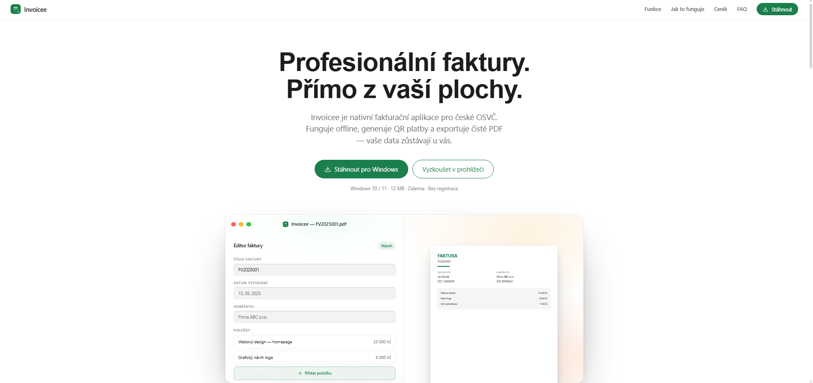

# Invoicee

A Czech-market invoicing app prototype — marketing/promo landing page plus a working browser-based invoice editor (live A4 preview, QR payment code, PDF export via print).



No build step: plain HTML files that load React 18, ReactDOM, and Babel Standalone from a CDN and transpile JSX in the browser.

## Run it

Open `Invoicee.html` or `Editor.html` directly in a browser, or serve the folder with any static file server:

```sh
npx serve .
```

## Structure

See [CLAUDE.md](./CLAUDE.md) for a full breakdown of the files and conventions.

## License

MIT — see [LICENSE](./LICENSE).
